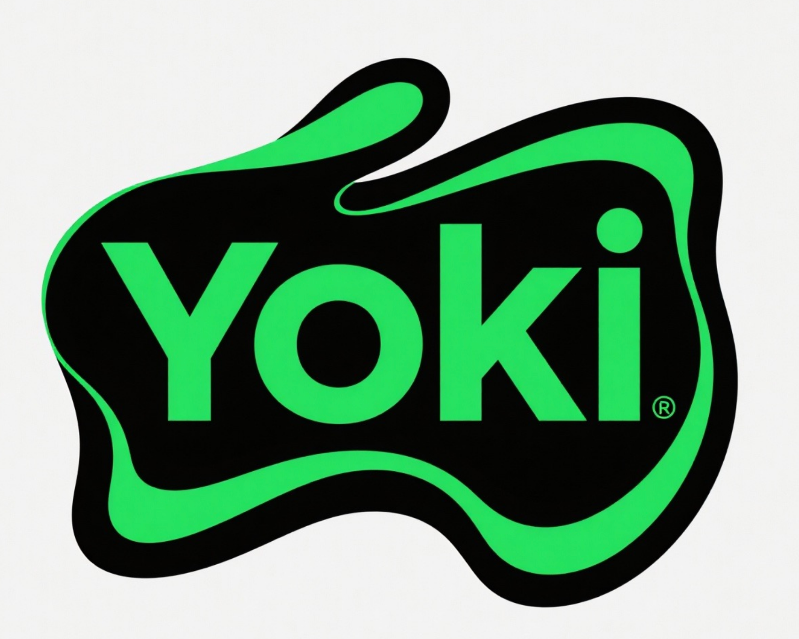
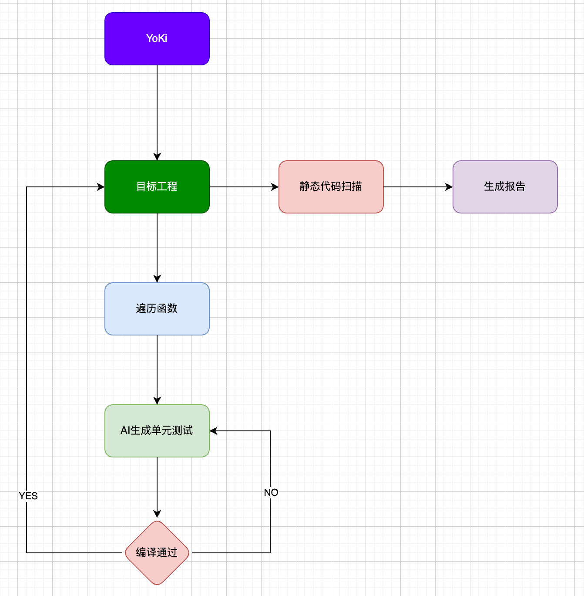

# Yoki



* Yoki is a static code analysis tool based on libtooling from LLVM.
* Yoki是一个基于LLVM libtooling库开发的静态代码检测工具，搭建了基本框架，只需向其中补充checker即可。

## 🔍 项目简介

Yoki 是一个基于 LLVM libtooling 库开发的现代化静态应用安全测试（SAST）工具。它提供了一个可扩展的框架，允许开发者轻松添加自定义的代码检查器来检测各种安全漏洞和代码质量问题。

## 🏛️ 系统架构



上图展示了 Yoki 的整体架构设计，包括：
- **AST 遍历层**: 基于 LLVM libtooling 进行源码解析
- **检查器层**: 可扩展的检查器框架
- **缺陷管理**: 统一的缺陷收集和管理机制
- **报告生成**: 多格式的报告输出系统

## ✨ 主要特性

- 🚀 **基于 LLVM**: 使用 LLVM libtooling 库进行精确的 AST 分析
- 📊 **专业报告**: 生成美观的 HTML 报告，支持排序和交互功能
- 🔧 **可扩展架构**: 模块化设计，易于添加新的检查器
- 📈 **多样化输出**: 支持 JSON 和 HTML 格式的报告输出
- ⚡ **高性能**: 基于 C++ 开发，处理速度快

## 🏗️ 项目结构

```
yoki/
├── src/                      # 源代码目录
│   ├── ast_traverse/        # AST 遍历相关
│   ├── checker/             # 检查器实现
│   ├── defect_manager/      # 缺陷管理
│   └── analysis/            # 分析引擎
├── report_template/         # HTML 报告模板
├── config_template/         # 配置文件模板
├── test/                    # 测试用例
└── third_party/             # 第三方依赖
```

## 🚀 快速开始

### 编译项目

```bash
# 创建构建目录
mkdir build && cd build

# 生成构建文件
cmake ..

# 编译项目
ninja
```

### 运行分析

```bash
# 分析项目
# 配置文件格式见config_tempalte文件夹
./bin/Yoki project_config.json
```

## 📋 报告格式

Yoki 生成的报告包含以下信息：

| 列名 | 描述 |
|------|------|
| 缺陷ID | 唯一标识符 |
| 检查器 | 检测到问题的检查器名称 |
| 缺陷描述 | 详细的问题描述 |
| 文件路径 | 问题所在的文件路径 |
| 行号 | 问题所在的行号 |

## 🔧 添加自定义检查器

1. 在 `src/checker/` 目录下创建新的检查器类
2. 继承 `CheckerBase` 基类
3. 实现相应的 AST 访问方法
4. 在检查器管理器中注册新检查器

## 📝 许可证

本项目采用 [LICENSE](LICENSE) 许可证。

## 🚧 TODO & 计划功能

### 即将推出的功能

- [ ] **🧪 自动单元测试生成**: 基于静态代码分析结果，为检测到的代码模式自动生成相应的单元测试用例
  - 分析函数签名和参数类型
  - 识别边界条件和异常情况
  - 生成覆盖主要执行路径的测试用例
  - 支持多种测试框架（Google Test、Catch2等）
  - 生成测试数据和Mock对象

### 未来规划

- [ ] **🔗 CI/CD集成**: 支持gitlab等主流DevOps工具
- [ ] **☁️ 云端分析**: 提供在线代码分析服务
- [ ] **📱 移动端查看**: 移动端报告查看应用
- [ ] **🤖 AI辅助**: 集成AI模型提供智能代码建议
- [ ] **📊 趋势分析**: 代码质量变化趋势跟踪

## 🤝 贡献

欢迎提交 Pull Request 和 Issue！

---

<p align="center">
  <i>基于 LLVM 构建的现代化静态代码分析工具</i>
</p>
